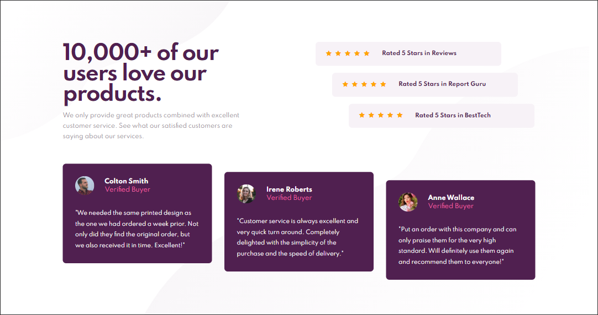
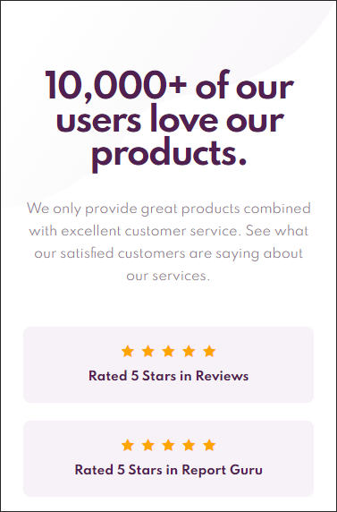
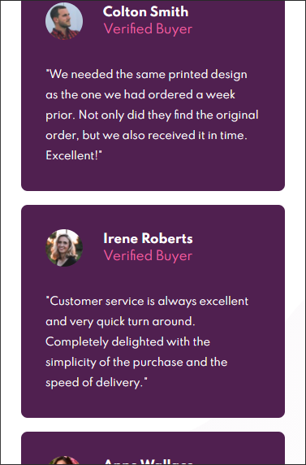

# Frontend Mentor - Social proof section solution

This is a solution to the [Social proof section challenge on Frontend Mentor](https://www.frontendmentor.io/challenges/social-proof-section-6e0qTv_bA). Frontend Mentor challenges help you improve your coding skills by building realistic projects.

## Table of contents

- [Overview](#overview)
  - [The challenge](#the-challenge)
  - [Screenshot](#screenshot)
  - [Links](#links)
- [My process](#my-process)
  - [Built with](#built-with)
  - [Deploy to](#deploy-to)
  - [Useful resources](#useful-resources)
- [Author](#author)

## Overview

### The challenge

The challenge is to build out this social proof section and get it looking as close to the design as possible.

Target:

- View the optimal layout for the section depending on their device's screen size

Please give some critique and advice to my code through Frontend Mentor. Thank you in advance.

### Screenshot

The designs were created to the following widths:

- Mobile: 375px
- Desktop: 1440px

#### Desktop

#### Mobile

### Links

- Solution URL: [GitHub](https://github.com/jojomanurung/SocialProofSection)
- Live Site URL: [SocialProofSection-FEM](https://socialproofsection-fem.netlify.app/)

## My process

### Built with

- Semantic HTML5 markup
- CSS custom properties
- Flexbox
- CSS Grid
- Mobile-first workflow
- [Styled Components](https://fontawesome.com/v4.7.0/) - For icons

### Deploy to

- [Netlify](https://netlify.com)

### Useful resources

- [Star Rating](https://www.w3schools.com/howto/howto_css_star_rating.asp) - This helped me for creating star rating.

## Author

- Frontend Mentor - [@jojomanurung](https://www.frontendmentor.io/profile/jojomanurung)
